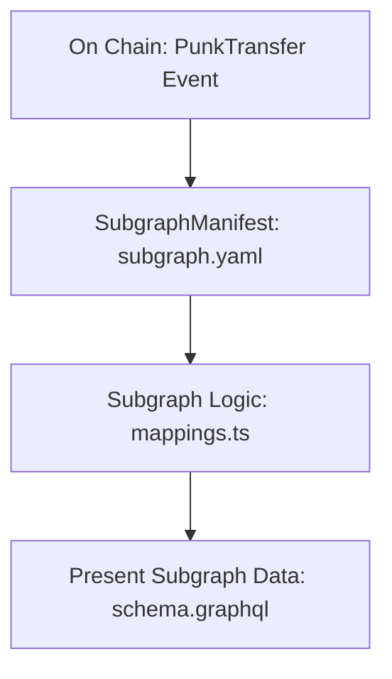

### The Graphを使用したCryptoPunksデータのサブグラフ作成ガイド

#### はじめに

このブログ記事では、The Graphを使用してEthereumのCryptoPunksスマートコントラクトのデータを取得し、サブグラフを作成する手順を紹介します。The Graphはブロックチェーンデータを効率的にクエリするための分散型プロトコルであり、DApp開発者にとって非常に役立つツールです。

#### 前提条件

1. **Node.js** と **yarn** がインストールされていること
2. **The Graph CLI** のインストール (`yarn global add @graphprotocol/graph-cli`)
3. **Ethereumの基本知識** および **CryptoPunksスマートコントラクト** についての基本的な理解

#### CryptoPunksのスマートコントラクト情報

CryptoPunksは、0xb47e3cd837ddf8e4c57f05d70ab865de6e193bbbのアドレスでデプロイされているスマートコントラクトで、Etherscanやその他のツールを使用して詳細を確認できます。

- [EtherscanのCryptoPunksページ](https://etherscan.io/token/0xb47e3cd837ddf8e4c57f05d70ab865de6e193bbb#code)
- [MiniScanのCryptoPunksページ](https://miniscan.xyz/?address=0xb47e3cd837ddf8e4c57f05d70ab865de6e193bbb&network=ethereum)
- [ABIファイルの取得](https://miniscan.xyz/code?network=ethereum&address=0xb47e3cd837ddf8e4c57f05d70ab865de6e193bbb&codeType=ABI)

#### サブグラフの初期化

まず、サブグラフを初期化します。以下のコマンドを実行してください。

```bash
graph init --studio helloownerthegraph01
```

プロンプトに従って、以下の情報を入力します。

- プロトコル: ethereum
- サブグラフスラッグ: helloownerthegraph01
- ディレクトリ: helloownerthegraph01
- Ethereumネットワーク: mainnet
- コントラクトアドレス: 0xb47e3cd837ddf8e4c57f05d70ab865de6e193bbb

次に、ABIファイルを取得するためのオプションが表示されますが、Etherscanからの取得に失敗する場合は、ローカルファイルとしてABIファイルを指定してください。

```bash
✔ ABI file (path) · /[full path]/abi.json
```

#### サブグラフの作成とデプロイ

初期化が完了すると、以下の手順でサブグラフを作成し、デプロイします。

1. The Graph Studioでデプロイキーを取得
2. 認証: `graph auth --studio [deploy key]`
3. ディレクトリに移動: `cd helloownerthegraph01`
4. コードの生成とビルド: `graph codegen && graph build`
5. デプロイ: `yarn deploy`

```bash
yarn deploy
```

デプロイが完了すると、サブグラフのクエリエンドポイントが生成されます。

#### サブグラフの構造

サブグラフの構造は、次のように設計されています。



この設計に基づき、サブグラフはEthereumのPunkTransferイベントをキャプチャし、サブグラフのロジックに従ってデータを処理し、最終的にデータをクエリ可能な形式で提供します。

#### サンプルクエリ

サブグラフがデプロイされた後、以下のようなクエリを実行してデータを取得できます。

```graphql
{
  assigns(first: 5) {
    id
    to
    punkIndex
    blockNumber
  }
  punkOffereds(skip:0 , first: 100){
    toAddress
  }
}
```

このクエリでは、最初の5つの`assigns`エンティティと、最初の100個の`punkOffereds`エンティティを取得します。

#### まとめ

この記事では、The Graphを使用してCryptoPunksのデータをクエリするサブグラフの作成手順を紹介しました。The Graphを使用することで、ブロックチェーンデータへのアクセスが簡単になり、DApp開発の可能性が広がります。興味があれば、公式ドキュメントを参照してさらに学びを深めてください。

---

**参考リンク**

- [The Graph Studio](https://thegraph.com/studio)
- [Etherscan](https://etherscan.io)
